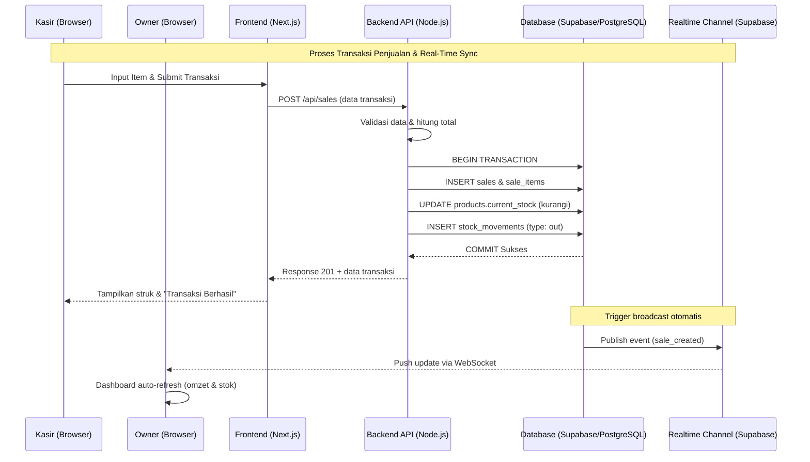
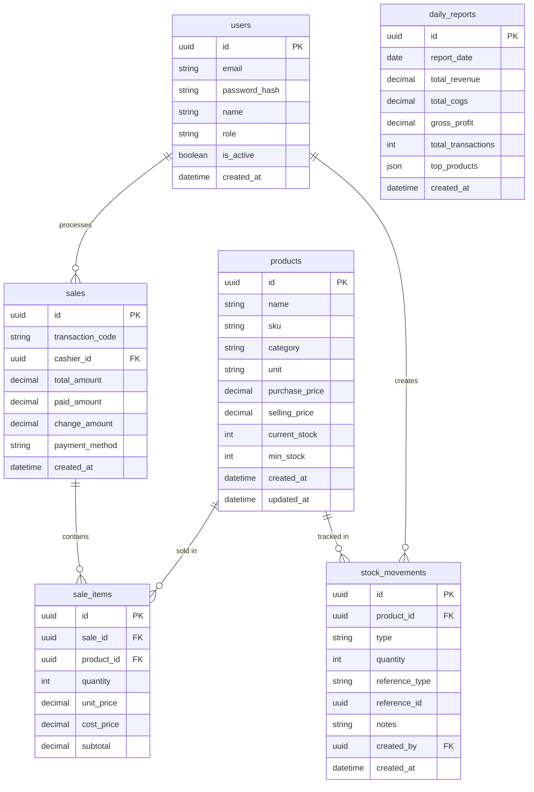
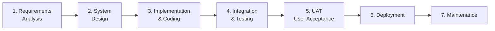

# PRD — Project Requirements Document
## Sistem Manajemen Inventaris & Pelaporan Keuangan Warung Madura

## 1. Overview
Aplikasi ini bertujuan untuk mendigitalkan operasional Warung Madura yang umumnya beroperasi 24 jam non-stop dengan sistem pencatatan manual (buku tulis atau ingatan). Masalah utama yang ingin diselesaikan adalah **ketidakmampuan pemilik untuk memantau stok barang dan transaksi penjualan secara real-time ketika sedang tidak berada di lokasi warung**, sehingga kerap terjadi kehabisan stok mendadak, ketidakcocokan kas, dan kesulitan menyusun laporan keuangan harian.

Tujuan utama aplikasi adalah menyediakan platform berbasis web yang **dapat diakses dari multi-device (HP, tablet, laptop)** sehingga pemilik dapat memantau pergerakan barang dan keuangan warung secara real-time dari mana saja. Sementara itu, kasir/penjaga warung memiliki antarmuka khusus untuk mencatat transaksi penjualan dan stok masuk dengan cepat. Sistem juga akan menghasilkan **laporan penjualan harian otomatis** yang terintegrasi dengan data inventaris dan keuangan.

## 2. Requirements
Berikut adalah persyaratan tingkat tinggi untuk pengembangan sistem:
- **Aksesibilitas:** Aplikasi harus berbasis web yang **fully responsive**, dapat diakses dari smartphone, tablet, dan komputer melalui browser modern (Chrome, Safari, Firefox).
- **Real-Time Sync:** Setiap transaksi yang dicatat oleh kasir harus langsung tercermin di dashboard pemilik tanpa perlu refresh manual (latency maksimal 3 detik).
- **Pengguna Multi-Role:** Sistem dirancang untuk dua peran utama: **Pemilik (Owner)** dengan akses penuh termasuk laporan keuangan, dan **Kasir (Cashier)** dengan akses terbatas pada modul transaksi & stok.
- **Otomatisasi Stok:** Stok produk harus berkurang otomatis saat transaksi penjualan dibuat, dan bertambah otomatis saat stok masuk dicatat.
- **Laporan Keuangan Terintegrasi:** Sistem harus menyediakan rekap penjualan harian, modal, laba kotor, dan produk terlaris secara otomatis.
- **Notifikasi Stok:** Peringatan stok rendah ditampilkan di dashboard dan dapat dikirim sebagai notifikasi push browser kepada pemilik.
- **Keamanan:** Otentikasi menggunakan email & password dengan enkripsi standar industri (bcrypt) dan sesi login menggunakan JWT.

## 3. Core Features
Fitur-fitur kunci yang harus ada dalam versi pertama (MVP):

1.  **Dashboard Real-Time (Owner View)**
    - Ringkasan penjualan hari ini (omzet, jumlah transaksi, laba kotor estimasi).
    - Grafik tren penjualan 7 hari terakhir.
    - **Panel Peringatan Stok:** Daftar produk yang stoknya di bawah batas minimum.
    - Indikator status warung (online/aktif transaksi).

2.  **Manajemen Produk (Master Data)**
    - Tambah, Edit, dan Hapus produk.
    - Kolom wajib: Nama Produk, SKU/Barcode, Kategori, Satuan, **Harga Modal**, **Harga Jual**, Stok Awal, dan Minimum Stok.
    - Pencarian dan filter berdasarkan kategori (rokok, sembako, minuman, dll).

3.  **Transaksi Penjualan / Point of Sale (Cashier View)**
    - Antarmuka POS sederhana yang dioptimasi untuk smartphone/tablet.
    - Pilih produk → input jumlah → tambahkan ke keranjang.
    - Input metode pembayaran (Tunai, QRIS, Transfer) dan jumlah uang diterima.
    - Sistem otomatis menghitung kembalian dan mengurangi stok.

4.  **Pencatatan Stok Masuk (Inbound)**
    - Form untuk menambah stok ketika barang datang dari supplier.
    - Input: Pilih Produk, Jumlah, Harga Modal Baru (jika berubah), dan Catatan Supplier.
    - Otomatis memperbarui `current_stock` dan menyimpan log pergerakan.

5.  **Laporan Penjualan Harian (Daily Sales Report)**
    - Rekap otomatis per tanggal: total omzet, total HPP (modal), laba kotor.
    - Daftar transaksi lengkap dengan detail produk yang terjual.
    - Top 5 produk terlaris harian.
    - Export ke format PDF / CSV.

6.  **Manajemen Pengguna**
    - Owner dapat menambah/menghapus akun kasir.
    - Pengaturan role dan password reset.

## 4. User Flow
Alur kerja sederhana untuk dua peran pengguna:

**A. Alur Pemilik (Owner) — Monitoring Jarak Jauh:**
1.  **Login:** Owner masuk via browser HP menggunakan email & password.
2.  **Dashboard:** Langsung melihat omzet real-time, stok menipis, dan grafik penjualan.
3.  **Drill-Down:** Klik salah satu transaksi untuk melihat detail item yang terjual oleh kasir.
4.  **Laporan:** Buka menu "Laporan Harian" untuk melihat rekap dan export jika perlu.
5.  **Manajemen:** Update harga, tambah produk baru, atau kelola akun kasir dari jarak jauh.

**B. Alur Kasir (Cashier) — Operasional di Warung:**
1.  **Login:** Kasir masuk dari tablet/HP yang ada di warung.
2.  **Buka POS:** Halaman default langsung mengarah ke modul transaksi penjualan.
3.  **Transaksi:** Pelanggan datang → Kasir scan/cari produk → input jumlah → pilih metode bayar → simpan.
4.  **Stok Masuk:** Saat barang datang, kasir membuka menu "Stok Masuk", input jumlah dan harga modal, lalu simpan.
5.  **Verifikasi:** Sistem otomatis update stok dan mengirim sinyal real-time ke dashboard owner.

## 5. Architecture
Berikut adalah gambaran arsitektur sistem dan aliran data secara teknis untuk skenario transaksi penjualan dengan sinkronisasi real-time:

## 6. Database Schema

Berikut adalah Entity Relationship Diagram (ERD) yang menggambarkan struktur database utama:

| Tabel | Deskripsi |
|-------|-----------|
| **users** | Data pengguna sistem (Owner & Kasir) beserta role-nya |
| **products** | Master data produk warung dengan harga modal, harga jual, dan stok |
| **sales** | Header transaksi penjualan beserta metode pembayaran |
| **sale_items** | Detail item per transaksi penjualan, menyimpan harga modal saat itu untuk kalkulasi laba |
| **stock_movements** | Log seluruh pergerakan stok (masuk/keluar/penyesuaian) untuk audit trail |
| **daily_reports** | Rekap harian otomatis yang di-generate untuk efisiensi laporan |

## 7. Development Methodology
Pengembangan sistem mengadopsi **Metodologi Waterfall dengan tahap UAT (User Acceptance Testing)** sebagai validasi akhir sebelum rilis. Pendekatan sekuensial dipilih karena scope MVP sudah terdefinisi jelas dan stakeholder utama (pemilik warung) menginginkan kepastian fitur sebelum implementasi.

| Fase | Aktivitas Utama | Deliverable |
|------|-----------------|-------------|
| **1. Requirements Analysis** | Wawancara pemilik warung, observasi operasional, finalisasi PRD | Dokumen PRD ini |
| **2. System Design** | Rancang ERD, wireframe UI, definisi API endpoints | ERD, Mockup UI, API Specification |
| **3. Implementation** | Coding frontend (Next.js), backend (Node.js), setup Supabase | Source code di repository Git |
| **4. Integration & Testing** | Unit test, integration test, bug fixing internal | Test report, build versi staging |
| **5. UAT** | Pengujian langsung oleh pemilik & kasir di lingkungan staging dengan skenario nyata | Berita Acara UAT (BAUT) yang ditandatangani |
| **6. Deployment** | Deploy ke production di Vercel, migrasi database produksi | Aplikasi live, dokumentasi user |
| **7. Maintenance** | Monitoring, bug fixing pasca rilis, dukungan teknis | Log monitoring & changelog |

**Kriteria UAT yang harus dipenuhi sebelum Deployment:**
- Seluruh Core Features (Section 3) berjalan tanpa error blocking.
- Pemilik berhasil memantau transaksi yang diinput kasir secara real-time dari device berbeda.
- Laporan harian menghasilkan angka yang sesuai dengan perhitungan manual untuk minimal 3 hari uji coba.
- Tidak ada bug kategori Critical atau High yang belum diselesaikan.

## 8. Design & Technical Constraints
Bagian ini mengatur batasan teknis dan panduan desain yang wajib dipatuhi selama pengembangan.

1.  **Technology Stack:**
    Sistem dibangun menggunakan stack teknologi modern berikut yang telah ditetapkan:
    -   **Frontend (UI Layer):** **Next.js** (React framework) dengan dukungan SSR/CSR, untuk performa rendering optimal di multi-device.
    -   **Backend (Logic & API):** **Node.js** sebagai runtime untuk API server yang menangani logika bisnis dan otentikasi. API dapat diimplementasikan menggunakan Next.js API Routes atau Express.js terpisah.
    -   **Database:** **PostgreSQL via Supabase** sebagai Backend-as-a-Service. Memanfaatkan fitur Supabase Realtime untuk WebSocket sync, Auth untuk otentikasi, dan Row Level Security (RLS) untuk keamanan data per role.
    -   **Deployment:** **Vercel** sebagai platform hosting frontend & API routes, dengan integrasi CI/CD otomatis dari Git repository.

2.  **Performance Constraints:**
    -   Waktu respon API maksimal **500ms** untuk operasi CRUD standar.
    -   Sinkronisasi real-time dari kasir ke dashboard owner maksimal **3 detik**.
    -   Aplikasi harus dapat berjalan lancar pada koneksi 3G untuk mendukung warung di area dengan koneksi terbatas.

3.  **Security Constraints:**
    -   Password disimpan dalam bentuk hash menggunakan bcrypt (cost factor minimal 10).
    -   Seluruh komunikasi API harus melalui HTTPS.
    -   Implementasi Row Level Security (RLS) di Supabase untuk memastikan kasir tidak dapat mengakses data laporan keuangan.

4.  **Typography Rules:**
    Sistem antarmuka (UI) wajib menggunakan konfigurasi font variable sebagai berikut untuk menjaga konsistensi visual:
    -   **Sans:** `Inter, ui-sans-serif, system-ui, sans-serif`
    -   **Serif:** `Source Serif Pro, ui-serif, Georgia, serif`
    -   **Mono:** `JetBrains Mono, ui-monospace, monospace`

5.  **Responsive Design Breakpoints:**
    -   Mobile: `< 768px` (prioritas utama untuk antarmuka kasir)
    -   Tablet: `768px – 1024px`
    -   Desktop: `> 1024px` (prioritas untuk dashboard owner)
